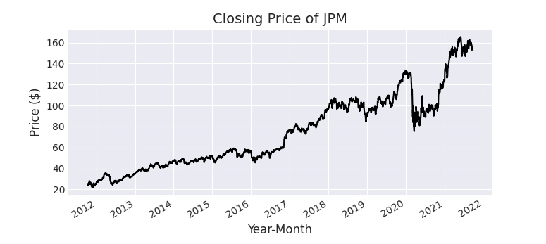
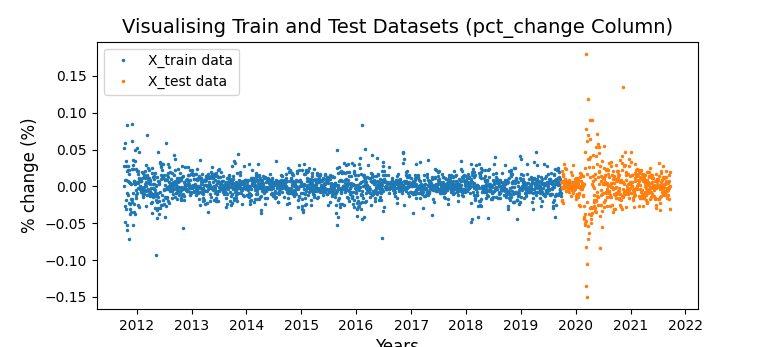
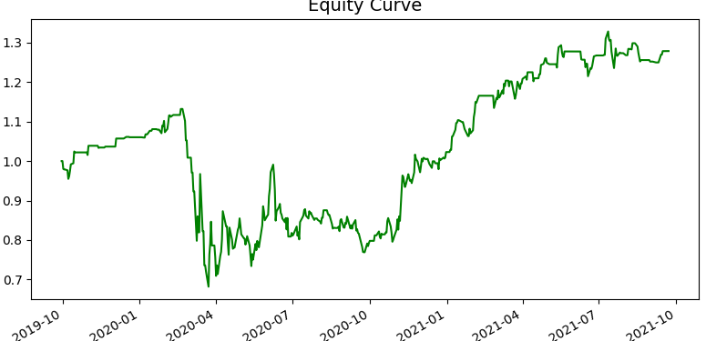
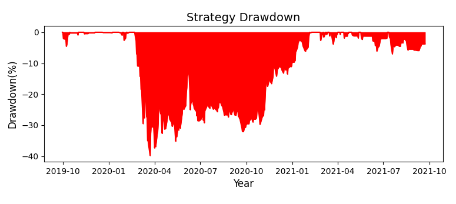

# QUANTATECH SECURITIES **ONE**
## _Machine Learning Model for analyzing stock prices_


[
**One** uses artificial intelligence and machine learning to predict buy orders on a user-determined security. The following information will further explain how to use **One** by walking through an example of an analyzation process the _J.P. Morgan_ (JPM) stock Price. 

1. Project Overview
2. J.P. Morgan Walkthrough Example
3. Dependencies
4. Additional Information

## Project Overview

Once run the model asks for a user-determined ticker symbol as input. It then retrieves OHLCV - data from ten years back in time. Further the model calculates signals and features using the retrieved data. The model then splits the data into a training and test set. Moving forwards, the scikit learn library is used to predict buy orders using the training dataset of the JPM stock. Once finished, the model backtests itself and prints a classification report with information such as the cumulative return of the model and an equity curve displaying how the portfolio would have changed using the models predictions on the test dataset.  

## J.P. Morgan Walkthrough Example
In order to run the program type the following command 

```sh
python one.py
```

You will the get prompted by an input message

```sh
<current date>
INPUT: 
```
Input the ticker symbol of the stock you want to analyze. **Not cap-sensitive**
Once entered, the model retrieves OHLCV - data from yahoo finance using the .download method of the yfinance library

```sh
data = yf.download(ticker, start='24.09.2020', end='24.09.2021', auto_adjust = True)
```
[

The model then calculates signals which are going to be used in the machine learning model. The signals are calculated that if the price of the stock the following day is higher than the current price of the stock, this day gets the signal **1**. However if the price of the stock the following day is lower than the current stock price, this day gets the signal **0**. The signals work as buy and sell orders. 

Further the model calculates the features of the stock price. The features are being used by the machine learning model to predict the following day's signal. The features used in this model are a variety of different technical indicators such as ADX, EMAs, RSI, volume and volatility. 

The signals and features are stored as datasets in two different variables. The features are further checked for correlation between each other. Here features which have correlating values are excluded from the feature dataset. This is crucial for obtaining precise output from the machine learning model. **Shit in, shit out**

```sh
def stationary(series):
    result = adfuller(series)
    if(result[1] < 0.05):
        return 'stationary'
    else:
        return 'not stationary'
for col in X.columns:
    if stationary(data[col]) == 'not stationary':
        X.drop(columns=[col], axis=1, inplace=True)
```

The features and signals are further writen into .csv files and stored in the repo.
```sh
X.to_csv(f"data/X_values_{ticker}.csv")
```
Moving on, the model creates four new variables
| Variable | Store |
| ------ | ------ |
| X_train |Features, training data |
| X_test | Features, testing data |
| Y_train| [Signals, training data |
| Y_test|Signals, testing data |

The variables store the feature data and signal data once split into training and testing groups. 
The data is split in a 80/20 format visually displayed on the image below

[

The testing and training data is further written into .csv files and stored in the repo. 

As of now, the model has everything it needs to initialize the machine learning model, learn from the training set and predict signals for the testing set. The program then _fits_ the model like shown below.

```sh
rf_model = RandomForestClassifier(n_estimators=3, max_features=3, max_depth=2, random_state=4)
rf_model.fit(X_train, y_train['signal'])
```

Further the model prints out the classification report with values calculated from running the machine learning model on the testing set. The classification report of the J.P. Morgan stock is shown below.

 ```sh
              precision    recall  f1-score   support

           0       0.48      0.35      0.40       242
           1       0.52      0.65      0.57       259

    accuracy                           0.50       501
   macro avg       0.50      0.50      0.49       501
weighted avg       0.50      0.50      0.49       501
```
1. 0 means no position
2. 1 means long position

As we can see the model has an accuracy of 50% when run on the JPM stock.

The program further calculates the cumulative return of the model, which tells us how well the model performed when run on the testing data.

 ```sh
strategy_data['cumulative_returns'] = (1+strategy_data['strategy_returns']).cumprod()

The cumulative return is 27.86%
```
The training and testing data was split using a 80/20 ratio, meaning that 80% of the data from the ten-year period of retrieved data was used for training and 20% was used for testing. Which further means that the testing was done one a two year period of data, whereas the model returned an ROI of 27.86%.

The model also displays the equity curve, which is used to understand how the portfolio would have changed using the model over a 2 years period. 

[

In addition the model also calculates risk factors such as the sharpe ratio and the maximum drawdown of the stock price. 

 ```sh
sharpe_ratio = round(strategy_data['strategy_returns'].mean() /
                     strategy_data['strategy_returns'].std() * np.sqrt(252*6.5), 2)

The Sharpe ratio is 2.62.
```

[


## Dependencies
The dependencies used in the project is listed below

| Dependency | Version|
| ------ | ------ |
| yfinance |0.1.63 |
| matplotlib | 3.4.3 |
| pandas| 1.3.3 |
| numpy|1.21.1 |
| statsmodels|0.12.2 |
| datetime | 0.7.5 |
| sklearn| 0.3.0 |
| seaborn|0.11.2 |
| sys|0.4 |

## Additional Information
1. If you have any questions about the project feel free to contact me over [Mail](quantatech.securities@gmail.com)
2. If you enjoyed the project make sure to share it with your friends!
3. Check out my other repos with finance related programs and tutorials


